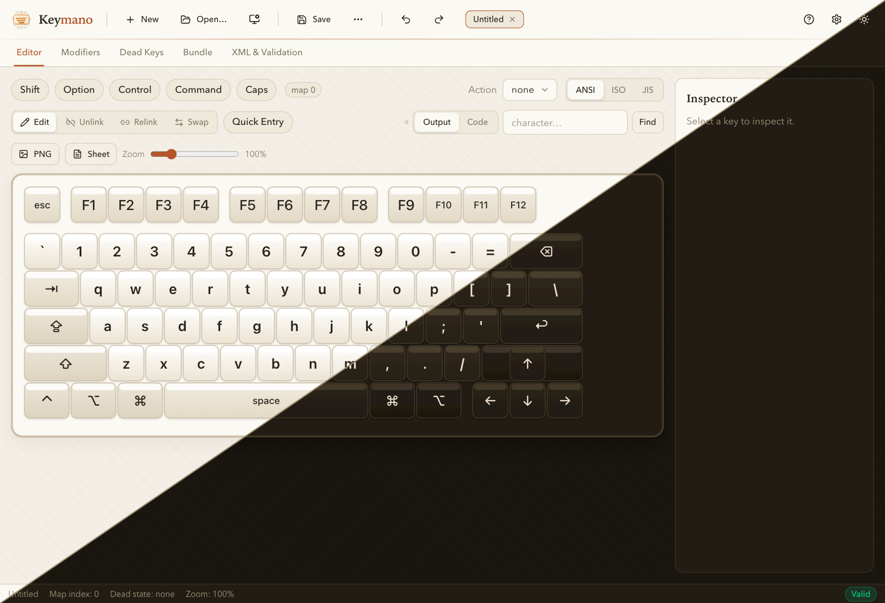
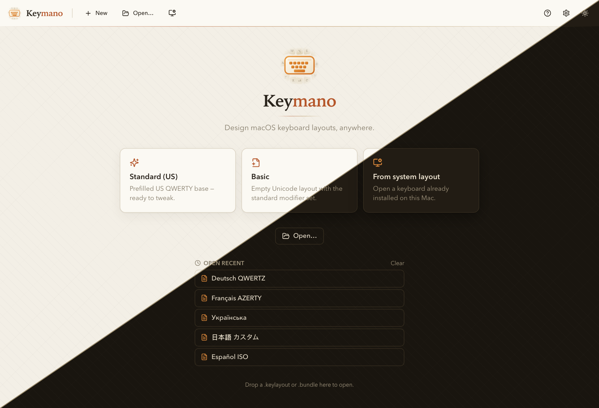
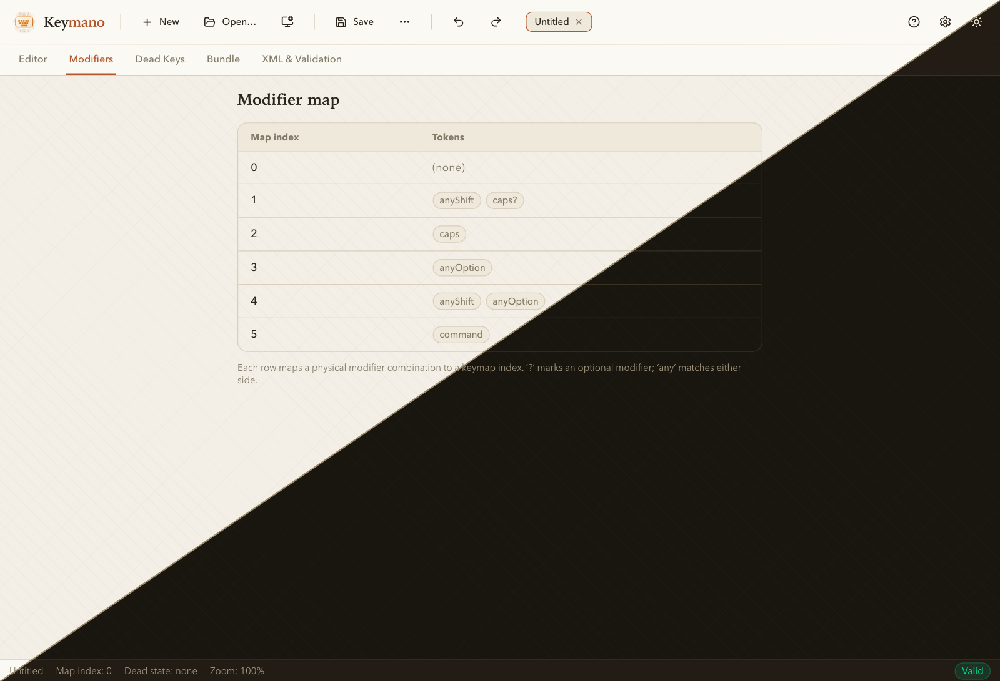
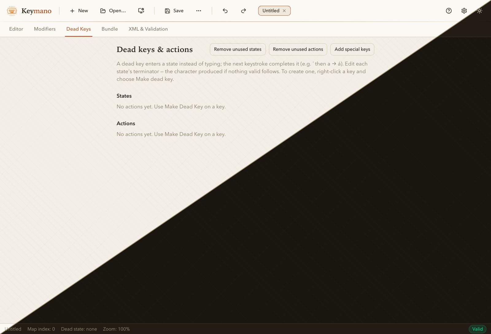
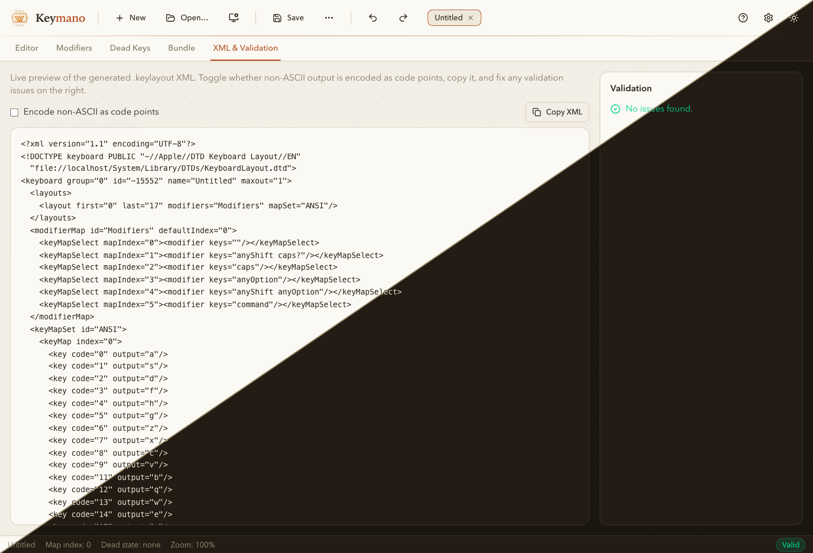

<div align="center">

# Keymano

### A modern, cross-platform keyboard layout editor for macOS `.keylayout` files and `.bundle` packages — an open-source alternative to Ukelele.

[](https://github.com/ysalitrynskyi/keymano/actions/workflows/ci.yml)
[](LICENSE)


[](https://keymano.ys.contact)

Build, edit, and inspect macOS keyboard layouts with a live, clickable keyboard —
no Xcode, no Apple Developer account, no Carbon APIs. Reads and writes the same
`.keylayout` XML and `.bundle` packages as Apple's tools and Ukelele.



<sub>Every screenshot below is split diagonally: light theme top-left, dark theme bottom-right.</sub>

</div>

---

**🌐 Read this in:** English · [Deutsch](docs/i18n/README.de.md) · [Français](docs/i18n/README.fr.md) · [Español](docs/i18n/README.es.md) · [Italiano](docs/i18n/README.it.md) · [Português](docs/i18n/README.pt.md) · [Nederlands](docs/i18n/README.nl.md) · [Polski](docs/i18n/README.pl.md) · [Українська](docs/i18n/README.uk.md) · [Русский](docs/i18n/README.ru.md) · [日本語](docs/i18n/README.ja.md) · [简体中文](docs/i18n/README.zh-Hans.md) · [繁體中文](docs/i18n/README.zh-Hant.md) · [한국어](docs/i18n/README.ko.md) · [हिन्दी](docs/i18n/README.hi.md) · [العربية](docs/i18n/README.ar.md) · [বাংলা](docs/i18n/README.bn.md) · [Bahasa Indonesia](docs/i18n/README.id.md) · [اردو](docs/i18n/README.ur.md) · [Türkçe](docs/i18n/README.tr.md) · [Tiếng Việt](docs/i18n/README.vi.md) · [فارسی](docs/i18n/README.fa.md) · [தமிழ்](docs/i18n/README.ta.md) · [मराठी](docs/i18n/README.mr.md)

> 🟢 **New to GitHub, or not a developer?** Read the plain-English
> **[Getting Started guide](docs/GETTING_STARTED.md)** — how to download, install,
> and use Keymano with zero technical knowledge (including the macOS “unsigned
> app” first-launch step).

## Three ways to run it

> 👉 **Just want to try it right now?** Open **[keymano.ys.contact](https://keymano.ys.contact)**
> — the full app in your browser, hosted by the maintainer. No install, no setup.

| Way | Who it's for | How |
| --- | --- | --- |
| **Download the desktop app** | Most users (macOS / Windows / Linux) | Grab a build from [Releases](https://github.com/ysalitrynskyi/keymano/releases), or build from source (below). |
| **Run in your browser** | Try it instantly, no install | Use the hosted instance at **[keymano.ys.contact](https://keymano.ys.contact)**, or run `pnpm dev` and open `http://localhost:1420` — the full UI runs against an in-browser mock backend. [Self-host it](#self-host-on-your-own-domain) with one Docker stack. |
| **Build from source** | Contributors, packagers | `pnpm install && pnpm tauri dev` — see [Build from source](#build-from-source). |

> The desktop app is a small native binary (Tauri + Rust). The browser version is
> the exact same UI. In the browser, Open imports a real `.keylayout` you pick,
> and Save/Export download a real `.keylayout` file; only installing into the
> system Keyboard Layouts folder is desktop-only (the browser downloads the file
> for you to place manually).

---

## What is Keymano?

**Keymano is a spiritual successor to [Ukelele](https://software.sil.org/ukelele/)** —
the long-standing macOS keyboard-layout editor by John Brownie / SIL International.
It offers the same core power — visual per-key editing, dead keys, modifier maps,
and bundles — rebuilt on a modern, portable stack that anyone can compile and run
in minutes, on any operating system.

If you have ever searched for any of the following, this is for you:

- a **Ukelele alternative** or **Ukelele replacement** that runs on Windows or Linux,
- how to **create a custom macOS keyboard layout** or **edit a `.keylayout` file**,
- a **keyboard layout editor** for building **dead keys**, accents, and custom symbols,
- a way to open, inspect, or repair an existing `.keylayout` / `.bundle` without a Mac.

### File-format compatible

Keymano reads **and** writes Apple's native formats, so layouts move freely between
Keymano, Ukelele, and macOS itself:

- **`.keylayout`** — Apple Keyboard Layout XML (the `KeyboardLayout.dtd` format).
- **`.bundle`** — multi-layout keyboard packages (`Info.plist`, `.strings`, icons).

Comments, modifier maps, dead-key state machines, and Unicode/codepoint outputs are
preserved through a parse → edit → serialize round-trip.

---

## Features

- **Visual editor** — click any key to set its output for any modifier combination
  and dead-key state; switch ANSI / ISO / JIS physical geometries.
- **Modifiers** — inspect the layout's real `keyMapSelect` map; latched (sticky)
  modifier layers for editing a whole layer at once.
- **Dead keys & actions** — make-dead-key flow, terminators, and housekeeping
  (remove unused states/actions, add the special-key outputs macOS expects).
- **Base-map inheritance** — unlink a key to make it absolute, or relink it to
  inherit again.
- **Editing aids** — Quick Entry (type characters straight onto keys), find-by-output,
  select-by-code, copy / paste / swap, and undo / redo with named actions.
- **Templates & system layouts** — start from Standard (US) or a blank Unicode
  layout; open installed `.keylayout` / `.bundle` files; install to and uninstall
  (move-to-Trash) from `~/Library/Keyboard Layouts`, with a live folder watch (macOS).
- **Export** — PNG of the current view, a monochrome reference sheet across every
  modifier map, and a live XML preview with validation and one-click auto-repair.
- **Polished app** — recent files, light / dark / system themes, a selectable keycap
  font, a per-page guided Help tour, and a UI translated into **24 languages**
  (including right-to-left scripts).

### Languages

The interface ships in 24 languages, with key-parity and placeholder-integrity
checks in CI:

English · Deutsch · Français · Español · Italiano · Português · Nederlands ·
Polski · Українська · Русский · 日本語 · 简体中文 · 繁體中文 · 한국어 · हिन्दी ·
العربية · বাংলা · Indonesia · اردو · Türkçe · Tiếng Việt · فارسی · தமிழ் · मराठी

---

## Screenshots

<table>
  <tr>
    <td width="50%"><br><sub><b>Welcome</b> — templates, recent files, drag-and-drop open.</sub></td>
    <td width="50%"><br><sub><b>Editor</b> — clickable keyboard, modifier layers, inspector.</sub></td>
  </tr>
  <tr>
    <td width="50%"><br><sub><b>Modifiers</b> — the real keyMapSelect map.</sub></td>
    <td width="50%"><br><sub><b>Dead Keys</b> — states, terminators, housekeeping.</sub></td>
  </tr>
  <tr>
    <td width="50%"><br><sub><b>XML &amp; Validation</b> — live `.keylayout` preview + auto-repair.</sub></td>
    <td width="50%" valign="top"><br><b>Themes</b><br><sub>Each image is one screenshot split diagonally — light (top-left) and dark (bottom-right) of the same screen. The app also follows your system appearance automatically.</sub></td>
  </tr>
</table>

---

## Install & run

### Download a build

Every tagged release is built by CI and published on the
[Releases page](https://github.com/ysalitrynskyi/keymano/releases) with bundles
for each platform: macOS (universal `.dmg`), Windows (`.msi` / `.exe`), and
Linux (`.deb` / `.AppImage`). The app is **unsigned** — on macOS, right-click the
app and choose *Open* the first time (Gatekeeper), or run
`xattr -dr com.apple.quarantine /Applications/Keymano.app`.

### Run in the browser (no install)

The entire UI runs in a browser against an in-memory backend — ideal for a quick
look or a hosted demo. Open imports a real `.keylayout` (parsed in the browser),
Save/Export download a real file, and Install downloads the file (placing it in
the system folder needs the desktop app). The in-browser backend is a functional
stand-in, not the authoritative Rust core — for production fidelity use the
desktop build.

```bash
pnpm install
pnpm dev
# open http://localhost:1420
```

### Build from source

**Prerequisites (all platforms):** [Rust](https://rustup.rs/) (stable),
[Node.js](https://nodejs.org/) 20+, and [pnpm](https://pnpm.io/) (`corepack enable`).

**Platform dependencies for the desktop build:**

<details>
<summary><b>macOS</b></summary>

Xcode Command Line Tools (`xcode-select --install`). Nothing else — the system
WebView is built in.

```bash
pnpm install
pnpm tauri dev                      # run in development
pnpm tauri build --bundles app      # produce Keymano.app (skips the .dmg step)
```
</details>

<details>
<summary><b>Windows</b></summary>

Install the **MSVC** C++ Build Tools and **WebView2** runtime (preinstalled on
Windows 11). Then:

```bash
pnpm install
pnpm tauri dev
pnpm tauri build                    # produces an .msi / .exe installer
```
</details>

<details>
<summary><b>Linux</b></summary>

Install WebKitGTK and friends (Debian/Ubuntu names shown):

```bash
sudo apt-get update
sudo apt-get install -y libwebkit2gtk-4.1-dev libappindicator3-dev librsvg2-dev patchelf
pnpm install
pnpm tauri dev
pnpm tauri build                    # produces .deb / .AppImage
```
</details>

### Run with Docker

The web app and all tests run in containers (the native desktop build needs a
system WebView and is built per-OS, not in Docker):

```bash
docker compose up web          # dev UI            -> http://localhost:1420
docker compose up web-prod     # production build  -> http://localhost:8080 (nginx)
docker compose run --rm check      # eslint + typecheck
docker compose run --rm web-test   # frontend tests (vitest)
docker compose run --rm core-test  # Rust core + session tests
```

### Self-host on your own domain

A multi-arch image (`amd64` + `arm64`) is published to the GitHub Container
Registry on every push to `main` (`:latest` + commit SHA) and on every `v*` tag
(`:1.2.3`, `:1.2`, `:latest`):

```
ghcr.io/ysalitrynskyi/keymano:latest
```

[`docker-compose.prod.yml`](docker-compose.prod.yml) runs that image behind a
[Cloudflare Tunnel](https://developers.cloudflare.com/cloudflare-one/connections/connect-networks/),
so nothing is exposed on the host — Cloudflare connects to the container over an
outbound-only tunnel. This is exactly how the hosted
**[keymano.ys.contact](https://keymano.ys.contact)** instance runs.

**Portainer (recommended):**

1. **Stacks → Add stack**, paste [`docker-compose.prod.yml`](docker-compose.prod.yml).
2. Under **Environment variables**, set `CLOUDFLARE_TUNNEL_TOKEN` (from the
   Zero Trust dashboard → **Networks → Tunnels → your tunnel → install token**).
3. **Deploy the stack.** The image is pulled from GHCR — no local build.
4. In the tunnel's **Public Hostnames**, add a route:
   `keymano.ys.contact` → `http://keymano:80`.

**Plain Docker Compose:**

```bash
cp .env.example .env          # then set CLOUDFLARE_TUNNEL_TOKEN
docker compose -f docker-compose.prod.yml up -d
```

> The hosted build is the in-browser app (full UI against the in-memory mock
> backend). For production-fidelity parsing/serialization, use the desktop app.

---

## Using Keymano

1. **Start a layout.** From the Welcome screen pick *Standard (US)*, *Basic* (empty
   Unicode), or open an existing `.keylayout` / `.bundle` (button or drag-and-drop).
   On macOS you can also fork from an installed layout.
2. **Edit keys.** Click a key, then *Edit* (or double-click) to set its output.
   Toggle Shift / Option / Control / Command / Caps to edit each modifier layer.
   Use *Quick Entry* to type characters directly onto successive keys.
3. **Dead keys.** Right-click a key → *Make dead key*, choose a state, set its
   terminator. Manage states and actions on the *Dead Keys* page.
4. **Validate.** The *XML & Validation* page shows the generated `.keylayout` and
   flags anything that would stop macOS from loading it, with one-click auto-repair.
5. **Save / install / export.** Save as `.keylayout` or `.bundle`. On macOS, *Install*
   copies to `~/Library/Keyboard Layouts/` — then add it in
   *System Settings → Keyboard → Input Sources* (or log out and back in). Export a
   PNG or a monochrome reference sheet for printing.

> **macOS built-in layouts are sealed.** Apple ships its bundled layouts (U.S.,
> Russian, …) in a binary bundle that no app can read — Ukelele can't either.
> Keymano lists them so you can start a blank layout named after one, but to edit a
> real layout, open its `.keylayout` / `.bundle` file directly.

---

## Troubleshooting & FAQ

<details>
<summary><b>macOS says the app is damaged / from an unidentified developer</b></summary>

The app is unsigned (it's free and open-source). Right-click the app → **Open** →
**Open**, just once. If it still won't open, run
`xattr -dr com.apple.quarantine /Applications/Keymano.app` in Terminal. Full
steps are in the [Getting Started guide](docs/GETTING_STARTED.md#first-launch-on-macos-important).
</details>

<details>
<summary><b>Windows SmartScreen warns about the installer</b></summary>

Because the build is unsigned, SmartScreen may show “Windows protected your PC.”
Click **More info → Run anyway**. The installer is the file published on the
[Releases page](https://github.com/ysalitrynskyi/keymano/releases).
</details>

<details>
<summary><b>I installed a layout but it's not in my input menu (macOS)</b></summary>

After **Install**, add it in **System Settings → Keyboard → Input Sources → Edit
→ +**, then pick it. If it doesn't appear, **log out and back in** (or restart) —
macOS only re-scans `~/Library/Keyboard Layouts` on login.
</details>

<details>
<summary><b>What's the difference between the browser and desktop versions?</b></summary>

Same UI. The browser version edits and downloads real `.keylayout` files but
can't write into the system Keyboard Layouts folder (browsers can't), and it uses
an in-browser stand-in for the Rust core. For installing layouts and
production-fidelity parsing, use the desktop app.
</details>

<details>
<summary><b>Can I edit one of Apple's built-in layouts?</b></summary>

Not directly — Apple ships those as a sealed binary bundle no app can read
(Ukelele can't either). Start a new layout, or open any standalone
`.keylayout` / `.bundle` file you have.
</details>

<details>
<summary><b>How do I report a bug or ask for a feature?</b></summary>

Open an [issue](https://github.com/ysalitrynskyi/keymano/issues) (see the
[step-by-step guide](docs/GETTING_STARTED.md#reporting-a-problem-or-asking-for-a-feature)).
For **security** problems use [SECURITY.md](SECURITY.md), not a public issue.
</details>

---

## Architecture

```
crates/keylayout-core    Pure Rust: model, parse, serialize, modifier resolution,
                         dead-key resolution, validation + repair, templates, ids,
                         special keys, bundles. No Tauri, fully unit-tested.
crates/keymano-session   Tauri-free document session: open docs, undo/redo, edits.
src-tauri                Thin Tauri command shell over the session (desktop).
src                      React + TypeScript frontend: keyboard, pages, ipc, i18n.
src/assets/keyboards     ANSI / ISO / JIS geometry presets (data-driven JSON).
```

The Rust core is portable and Tauri-free, so the same parsing and serialization
logic powers the desktop app, the tests, and (potentially) other front-ends.
Deep-dive docs live in [`docs/`](docs/) — start with
[`docs/00-overview`](docs/00-overview.md). Reviewers/auditors: see the
[review guide](docs/15-review-guide.md).

---

## Contributing

Issues and pull requests are welcome. See [CONTRIBUTING.md](CONTRIBUTING.md) for the
build/test workflow and conventions, and the [Code of Conduct](CODE_OF_CONDUCT.md).
Found a security issue? Please follow [SECURITY.md](SECURITY.md) — don't open a
public issue.

Quick local checks before a PR:

```bash
pnpm lint && pnpm exec tsc -b && pnpm test
cargo test -p keylayout-core -p keymano-session
cargo clippy --workspace --all-targets -- -D warnings
```

---

## Examples

The [`examples/`](examples/) folder ships four Keymano-generated phonetic
Cyrillic `.keylayout` files (Ukrainian, Bulgarian, Serbian, Macedonian) to open
right away — **File → Open…** or drag one onto the window.
They're produced by the project's own serializer and verified in CI to parse,
validate, and expose each language's full alphabet. See
[`examples/README.md`](examples/README.md).

---

## Privacy

Keymano does not collect, transmit, log, or share any data. The desktop app
runs entirely offline; the hosted web build sets no cookies and runs no
analytics or trackers by default (enforced by the project's strict
[Content Security Policy](docker/nginx.conf)). A self-hoster can optionally
enable Google Analytics on the web build via the `GA_MEASUREMENT_ID`
environment variable (off unless set); the desktop app has no analytics path.
See [PRIVACY.md](PRIVACY.md) for the full statement.

## License

Keymano is released under the [Apache License 2.0](LICENSE). Third-party
runtime dependencies and their licenses are listed in
[THIRD_PARTY_NOTICES.md](THIRD_PARTY_NOTICES.md). All original code;
format compatibility is derived from Apple's public `KeyboardLayout.dtd` and the
open-source Ukelele project. "Apple", "macOS", and "Ukelele" are trademarks of their
respective owners; Keymano is an independent project and is not affiliated with or
endorsed by Apple or SIL International.

## Acknowledgements

- [Ukelele](https://software.sil.org/ukelele/) by John Brownie / SIL International —
  the reference and inspiration for this project.
- [Tauri](https://tauri.app/), [Rust](https://www.rust-lang.org/), and the React +
  Vite ecosystem.

---

**🌐 README in other languages:** [Deutsch](docs/i18n/README.de.md) · [Français](docs/i18n/README.fr.md) · [Español](docs/i18n/README.es.md) · [Italiano](docs/i18n/README.it.md) · [Português](docs/i18n/README.pt.md) · [Nederlands](docs/i18n/README.nl.md) · [Polski](docs/i18n/README.pl.md) · [Українська](docs/i18n/README.uk.md) · [Русский](docs/i18n/README.ru.md) · [日本語](docs/i18n/README.ja.md) · [简体中文](docs/i18n/README.zh-Hans.md) · [繁體中文](docs/i18n/README.zh-Hant.md) · [한국어](docs/i18n/README.ko.md) · [हिन्दी](docs/i18n/README.hi.md) · [العربية](docs/i18n/README.ar.md) · [বাংলা](docs/i18n/README.bn.md) · [Bahasa Indonesia](docs/i18n/README.id.md) · [اردو](docs/i18n/README.ur.md) · [Türkçe](docs/i18n/README.tr.md) · [Tiếng Việt](docs/i18n/README.vi.md) · [فارسی](docs/i18n/README.fa.md) · [தமிழ்](docs/i18n/README.ta.md) · [मराठी](docs/i18n/README.mr.md)

<div align="center">
<sub>Keywords: macOS keyboard layout editor · Ukelele alternative · edit .keylayout · create custom keyboard layout · keyboard .bundle · dead keys · cross-platform keyboard layout tool</sub>
</div>
